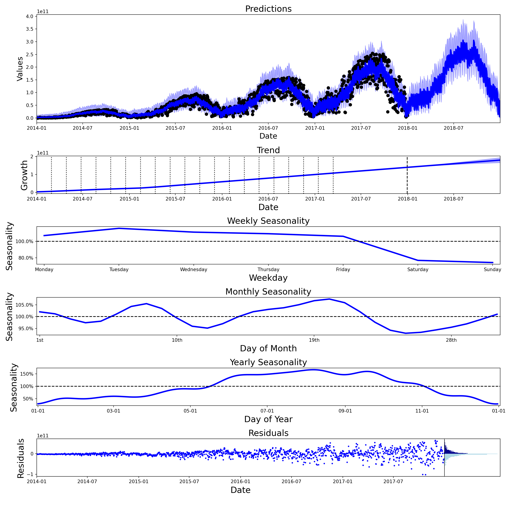

# Chronos

Simple time series prediction model. Implemented using <a href="https://pyro.ai/" target="_blank">Pyro</a> and greatly inspired by <a href="https://facebook.github.io/prophet/" target="_blank">Prophet</a>.

## Requirements:

* python >= 3.7
* pandas >= 1.1
* numpy >= 1.19
* matplotlib >= 3.2
* torch >= 1.5
* pyro-ppl >= 1.3


## Installation

To install chronos, run the following command from your terminal:
```python
pip install chronos-forecast
```

## Simple Use Case

With the files included, you can load the [Divvy bike daily](https://www.kaggle.com/yingwurenjian/chicago-divvy-bicycle-sharing-data?select=data.csv) data (the data has been aggregated since the original file is 2GB) as follows:

```python
import pandas as pd
import numpy as np

divvy_data = pd.read_csv('data/divvy_daily_rides.csv')
divvy_data['ds'] = pd.to_datetime(divvy_data['ds'])
print(divvy_data.head())
```
```
          ds          y
0 2014-01-01  105421324
1 2014-01-02  123221770
2 2014-01-03    6662107
3 2014-01-04  201035389
4 2014-01-05   35549270
```

You can call Chronos as follows:

```python
>>> from chronos import Chronos
>>> import chronos_plotting
>>>
>>> my_chronos = Chronos(seasonality_mode="mul", distribution="Gamma")
>>> my_chronos.fit(divvy_data)
Employing Maximum A Posteriori
100.0% - ELBO loss: -1.5903 | Mean Absolute Error: 11152849920.0000

>>> predictions = my_chronos.predict(period=365)
Prediction no: 1000
>>> chronos_plotting.plot_components(predictions, my_chronos)
```



Notice we can specify the distribution of the ride shares to be a gamma distribution to ensure they are never negative. Additionally, we made the seasonality multiplicative to make sure that its affect increases as the absolute number of
rides increases.

