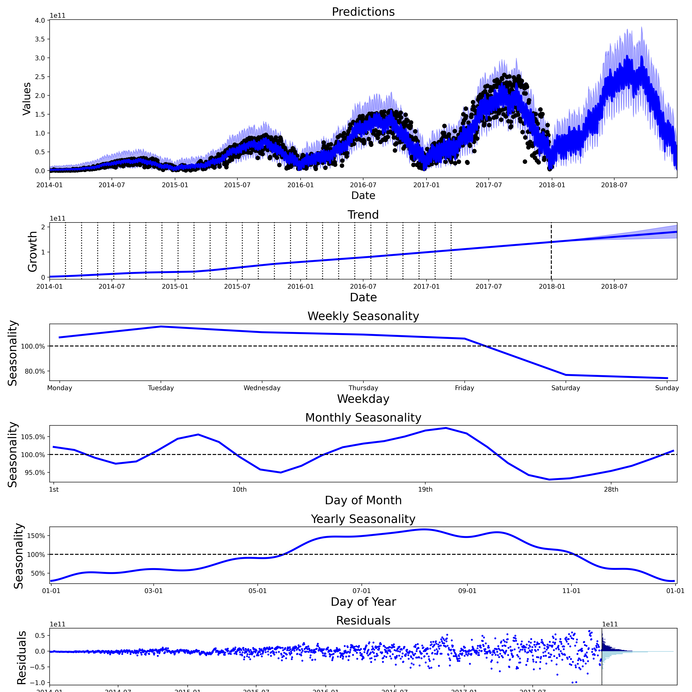

# Chronos


Simple time series prediction model. Implemented using <a href="https://pyro.ai/" target="_blank">Pyro</a> and greatly inspired by <a href="https://facebook.github.io/prophet/" target="_blank">Prophet</a>.

## Simple Use Case

Assuming you have a time series pandas dataframe named `ts_df` which looks as follows:

```python
    ds         y
0 2016-01-01  0.000000
1 2016-01-02  0.043327
2 2016-01-03  0.086617
3 2016-01-04  0.129833
4 2016-01-05  0.172939
```

You can call Chronos as follows:

```python
>>> my_chronos = Chronos()
>>> my_chronos.fit(ts_df)
Employing Maximum A Posteriori
100.0% - ELBO loss: -2.4531 | Mean Absolute Error: 0.2296   

>>> predictions = my_chronos.predict(period=31)
Prediction no: 1000
>>> chronos_plotting.plot_components(predictions, my_chronos)
```


